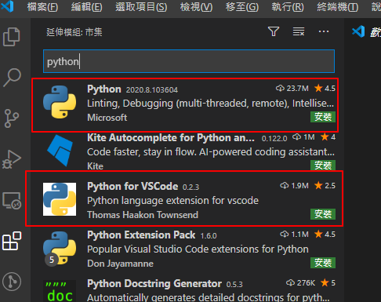
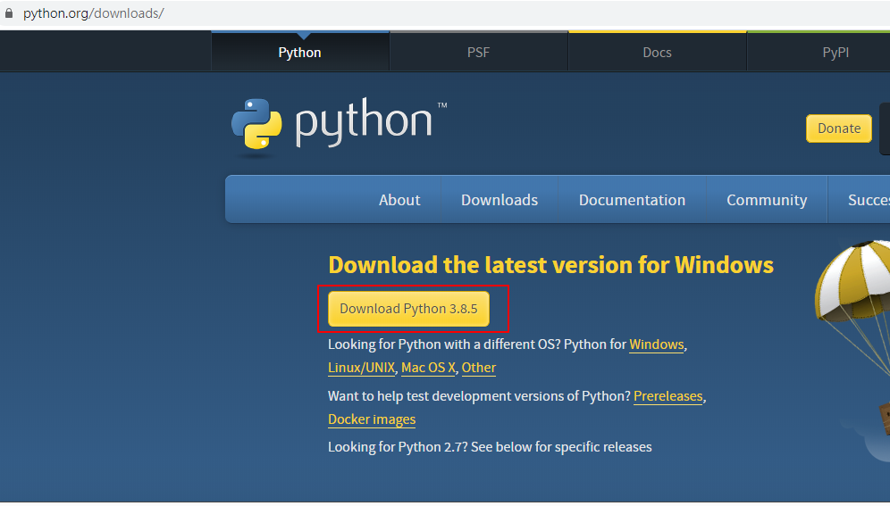
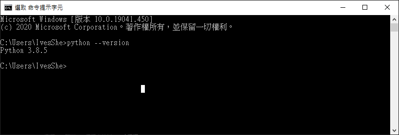
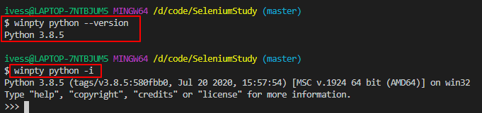
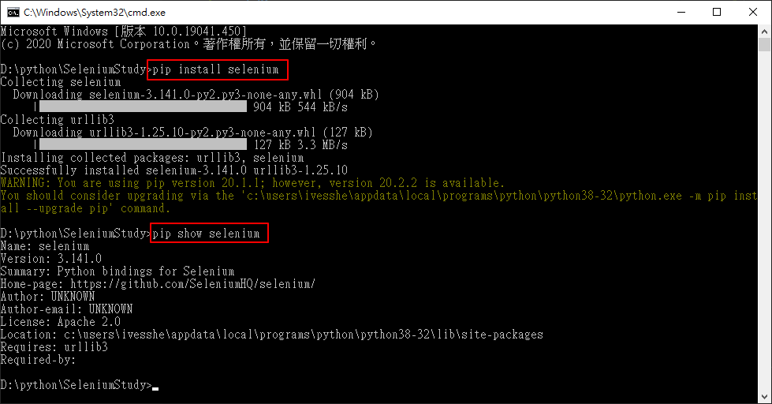
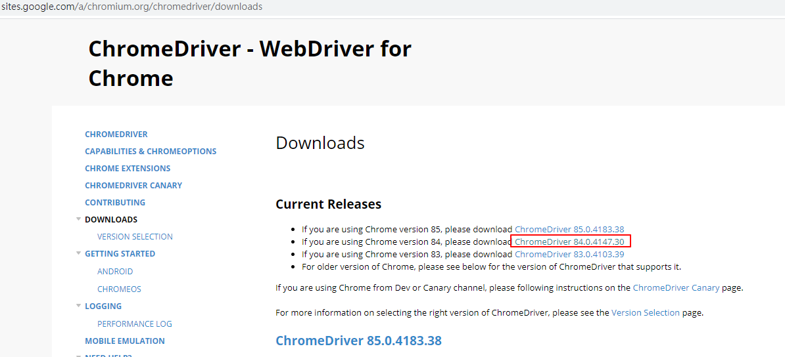
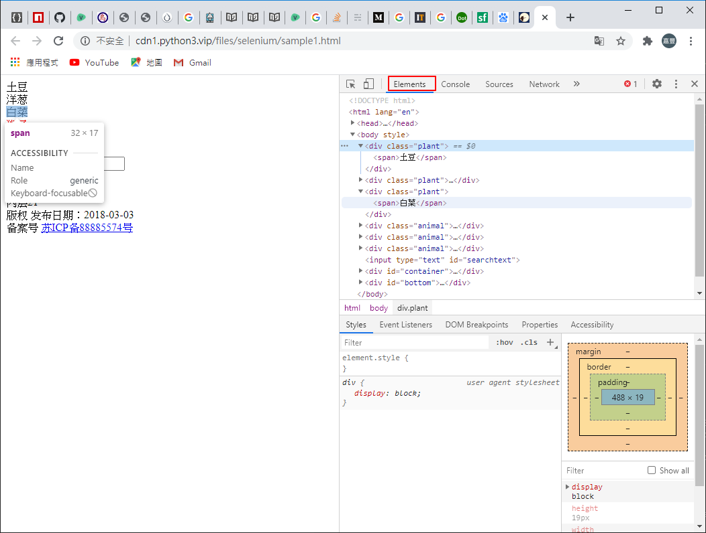
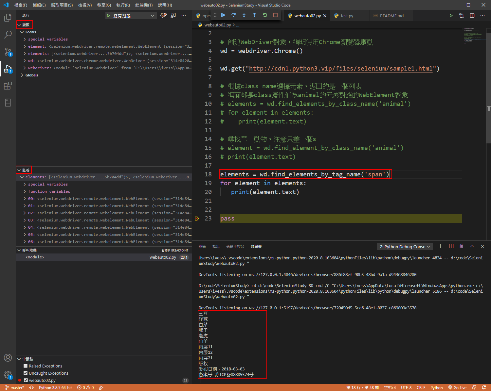
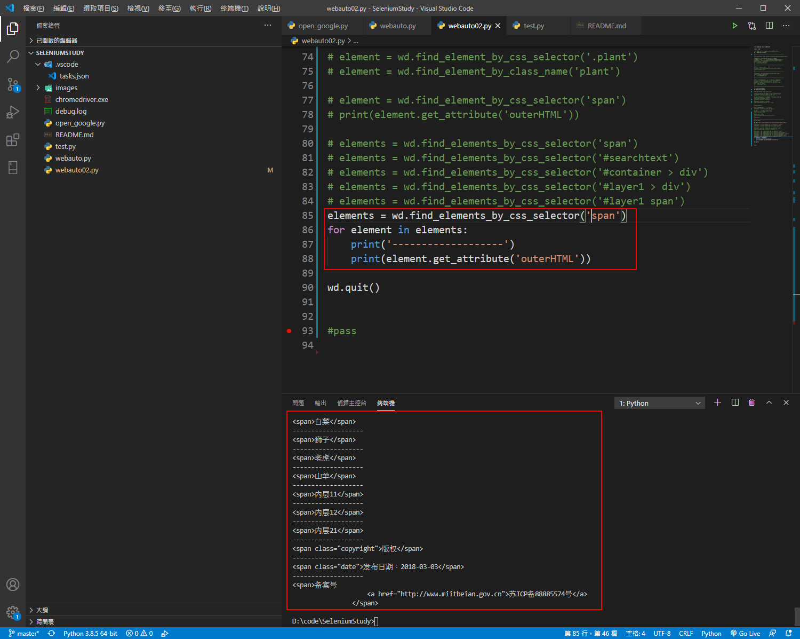
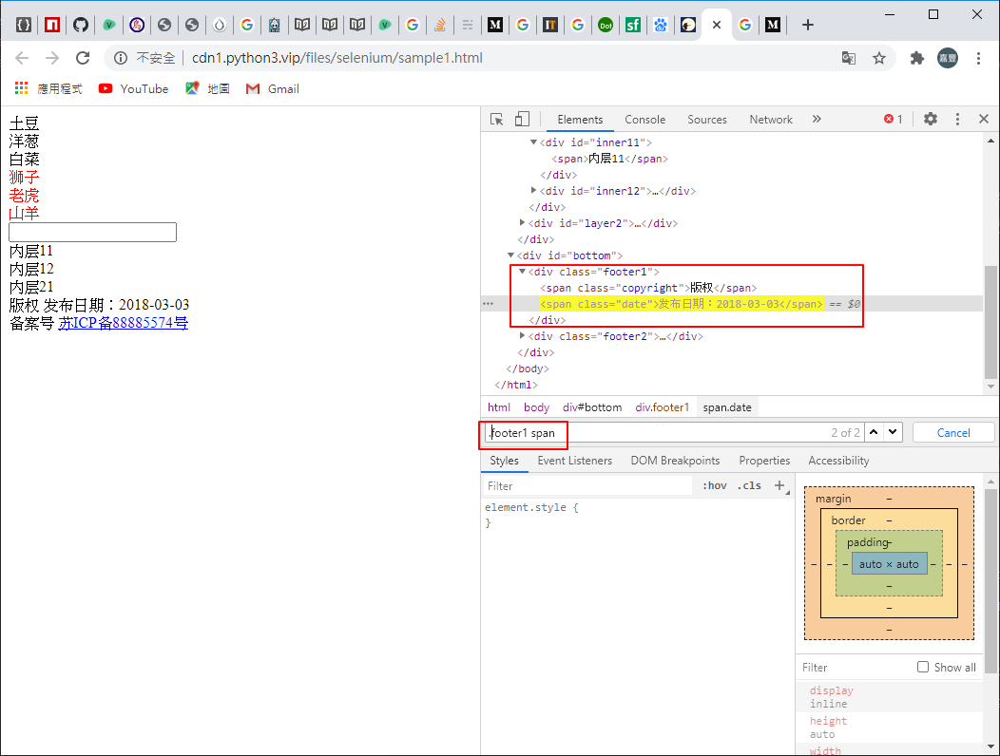

# SeleniumStudy

# 安裝VSCode外掛 Python extension



使用過程中，若有提示安裝的項目，可以一併裝一裝

# 安裝python3



# 檢視版本



本來以為在git bash的環境下無法下python的指令，後來google一下，發現前面加winpty再下指令即可

```shell
winpty python --version
Python 3.8.5
```



[參考網址](https://www.itread01.com/content/1546861334.html)

# 安裝 Selenium 的 Python 套件

```shell
pip install selenium
pip show selenium
```



# 下載 Chrome 的 ChromeDriver

[下載網址](https://sites.google.com/a/chromium.org/chromedriver/)




https://medium.com/begonia-design/vs-code-python-selenium-%E8%87%AA%E5%8B%95%E5%8C%96%E6%B8%AC%E8%A9%A6-part-1-30d6c0ea92af

# CSS 選擇器 語法簡易整理


```python
# 選擇單個元素
find_element_by_css_selector(CSS Selector参数)

# 選擇多個元素
find_element_by_css_selector(CSS Selector参数)

# 選擇所有tag名為div的元素
elements = wd.find_elements_by_css_selector('div')

# 等同
elements = wd.find_elements_by_tag_name('div')

# 根據id屬性尋尋找
element = wd.find_element_by_css_selector('#searchtext')

# 選擇所有class屬性值為animal的元素
elements = wd.find_elements_by_class_name('animal')

elements = wd.find_elements_by_css_selector('.animal')
```

選擇直接子元素

```python
元素1 > 元素2

元素1 > 元素2 > 元素3 > 元素4
```

選擇子元素

```python
元素1 元素2

元素1   元素2   元素3  元素4
```

```python
# 根據屬性選擇元素
element = wd.find_element_by_css_selector('[href="http://www.miitbeian.gov.cn"]')
```

CSS selector 選擇語法可以聯合使用

```python
div.footer1 > span.copyright
# or
.footer1 > .copyright

.footer1  .copyright
```

組選擇

```python
# 同時選擇所有class為plant和class為animal
.plant , .animal

# 同時選擇所有tag名為div的元素 和 id為BYHY的元素
div,#BYHY

elements = wd.find_elements_by_css_selector('div,#BYHY')
for element in elements:
    print(element.text)
```

```python
# 選擇所有id為t1裡面的span 和 所有的p元素
#t1 > span,p

# 選擇所有id為t1裡面的span 和 p元素
#t1 > span , #t1 > p
```

```python
# 父元素的第n個子節點
nth-child

# 選擇第二個子元素，且是span類型
span:nth-child(2) 

# 不限制節點類型
:nth-child(2)

# 父元素的倒數第n個子節點
# 選擇倒數第1個子元素
p:nth-last-child(1)

# 父元數的第幾個某類型的子節點
nth-of-type

# 選擇第2個子元素，且是span類型
span:nth-child(2) 

# 選擇第一個span類型的子元素
span:nth-of-type(1)

# 父元素的倒数第几个某类型的子节点
nth-last-of-type

p:nth-last-of-type(2)

# 奇數節點
nth-child(odd)

p:nth-child(odd)

# 偶數節點
nth-child(even)

p:nth-child(even)

# 要選擇父元素的某類型 偶數節點
nth-of-type(even)

# 要選擇父元素的某類型 奇數節點
nth-of-type(odd)

# 相鄰兄弟節點
h3 + span

# 後續所有兄弟節點選擇
h3 ~ span
```

# frame切換/窗口切換

```python
wd.switch_to.frame(frame_reference)

wd.switch_to.frame('frame1')

wd.switch_to.frame('innerFrame')

wd.switch_to.frame(wd.find_element_by_tag_name("iframe"))
```

```python
# 先根据name属性值 'innerFrame'，切换到iframe中
wd.switch_to.frame('innerFrame')

# 根据 class name 选择元素，返回的是 一个列表
elements = wd.find_elements_by_class_name('plant')

for element in elements:
    print(element.text)
```

切換回來

```python
wd.switch_to.default_content()
```

# 執行畫面









[參考網址](http://www.python3.vip/tut/auto/selenium/01/)
